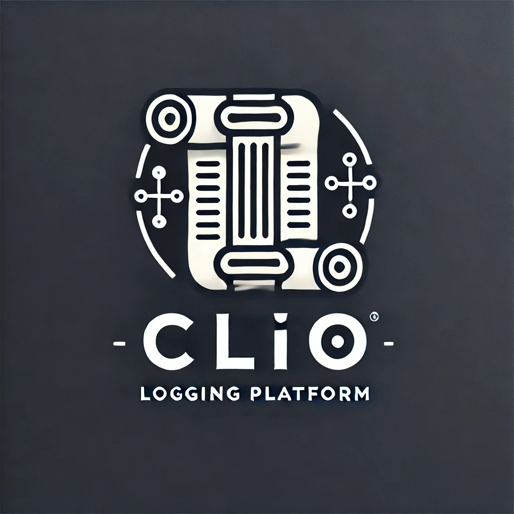

# Clio Logging Platform
<p align="center">

</p>

A secure, collaborative logging system designed for red team operations and security assessments. This application provides real-time logging capabilities with features like row locking, user authentication, and audit trails.

## Key Features

- **Real-time Collaborative Logging**: Multiple users can view and edit logs simultaneously
- **Row-Level Locking**: Prevent conflicts with row-level locking mechanism
- **Role-Based Access Control**: Admin and user roles with different permissions
- **Secure Authentication**: CSRF protection, secure session management, and password policies
- **Relationship Analysis**: Visualize connections between hosts, IPs, domains, and user commands
- **File Status Tracking**: Monitor file status across systems (ON_DISK, IN_MEMORY, ENCRYPTED, etc.)
- **API Integration**: Programmatic access for automated log submission and integration with external tools
- **Evidence Management**: Upload and track evidence files associated with logs

## Quick Start

### Prerequisites

- Docker and Docker Compose
- Node.js 18 or higher (for setup scripts)
- npm (Node Package Manager)

### Setup

1. Clone the repository:
   ```bash
   git clone https://github.com/seahop/Clio.git
   cd Clio
   ```

2. Generate environment variables and security keys:
   ```bash
   # Using Python
   python generate-env.py https://yourDomainOrIP.com:3000
   # Or default to localhost
   python generate-env.py
   ```

3. Build and start the containers:
   ```bash
   docker-compose build
   docker-compose up
   ```

4. Access the application at:
   - https://localhost:3000 (or your custom domain/IP)

The default admin and user passwords will be displayed in the console output and saved in a credentials backup file.

## Documentation

For detailed information about Clio, please refer to our documentation:

- [Architecture Overview](./docs/architecture.md) - System architecture and technology stack
- [Security Features](./docs/security.md) - In-depth security information
- [User Guide](./docs/user-guide.md) - How to use the application
- [API Documentation](./docs/api-guide.md) - Working with the Clio API
- [Development Guide](./docs/development.md) - Information for developers

## License

This software is provided as-is for use by red team professionals.

The license requires:
- You must include the original license and copyright notice
- The authors cannot be held liable

You can:
- ✔️ Use this software for commercial purposes
- ✔️ Modify this software
- ✔️ Distribute this software
- ✔️ Use this software privately
- ✔️ Use this software for patent purposes
- ✔️ Fork and modify for internal company use