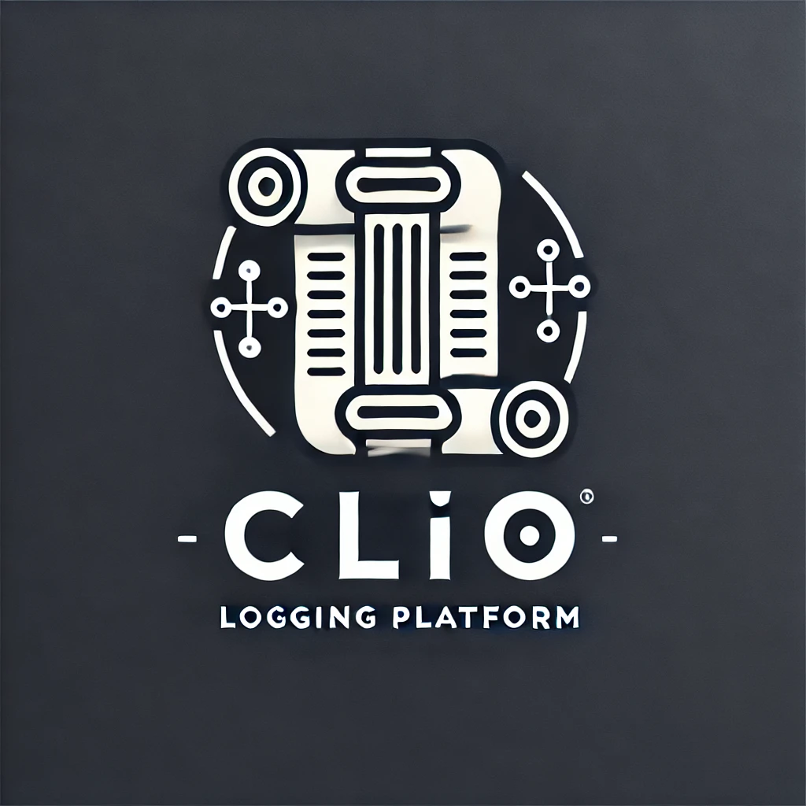

<h1 align="center">Clio Logging Platform</h1>
<p align="center">

</p>

A secure, collaborative logging system designed for red team operations and security assessments. Provides real-time logging with role-based access control, automatic operation tagging, relational analysis, evidence management, and C2 ingest integration.

## Key Features

- **Operations scoping** — users are assigned to operations and only see logs for their own engagement
- **Relational analysis** — automatic correlation of IPs, hostnames, domains, users, MAC addresses, and commands
- **Real-time collaborative logging** — multiple operators view and edit simultaneously with row-level locking
- **Role-based access control** — admin and user roles with per-operation data isolation
- **Secure authentication** — JWT in httpOnly cookies, CSRF protection, per-user passwords
- **Evidence attachments** — upload and track evidence files tied to individual log entries
- **Log templates** — reusable field presets for common activity types
- **API key ingest** — push logs from C2 frameworks via `/api/ingest`
- **Export** — CSV and database export with filtering
- **File status tracking** — monitor file state across systems (ON_DISK, IN_MEMORY, ENCRYPTED, etc.)

---

## Deployment

### Option A — Single container (recommended, simplest)

Pull and run the all-in-one image. Nginx, backend, Redis, and PostgreSQL are all bundled. All persistent data (database, exports, logs, evidence) lives in a single Docker volume.

```bash
docker run -d --name clio \
  -p 443:443 -p 80:80 \
  -e EXTERNAL_HOSTNAME=your-server-ip \
  -v clio-data:/data \
  ghcr.io/seahop/clio:latest
```

Or with docker compose:

```bash
# Edit EXTERNAL_HOSTNAME in docker-compose.omnibus.yml first, then:
docker compose -f docker-compose.omnibus.yml up -d
```

#### Getting your credentials

On first boot Clio generates random passwords for every service and prints them to the container logs:

```bash
docker logs clio
```

Look for the first-boot banner:

```
┌──────────────────────────────────────────────────┐
│             Clio — First Boot                    │
│                                                   │
│  Admin password : <generated>                    │
│  Access         : https://your-server-ip         │
└──────────────────────────────────────────────────┘
```

To retrieve credentials at any time after first boot:

```bash
# Admin and shared user bootstrap password
docker exec clio sh -c '. /data/.secrets.env; echo "admin / $ADMIN_PASSWORD"; echo "user  / $USER_PASSWORD"'
```

> **Note on the user password:** Clio does not have a user registry. Any username combined with the shared `USER_PASSWORD` creates an account on first login — the user is then prompted to set their own password. The admin password works the same way.

#### EXTERNAL_HOSTNAME

Set this to your server's IP address or domain name. It is written into the self-signed TLS certificate SAN and the CORS allowed-origins list. Defaults to `localhost` if not set (fine for local testing, wrong for remote access).

#### EXTERNAL_PORT

Set this when you map the container's HTTPS port to a non-standard host port (e.g. `-p 8443:443` → `EXTERNAL_PORT=8443`). It is included in the CORS allowed origin and in the default SSO callback URLs, so logins work without manually overriding `OIDC_CALLBACK_URL` / `GOOGLE_CALLBACK_URL`. Leave unset (or `443`) on the default port.

#### What persists in the volume

Everything in the `clio-data` volume survives container restarts and upgrades:

| Path in volume | Contents |
|---|---|
| `/data/.secrets.env` | Generated passwords and secrets |
| `/data/certs/` | TLS certificates |
| `/data/pgdata/` | PostgreSQL database |
| `/data/redis/` | Redis AOF data |
| `/data/exports/` | CSV / evidence exports created via the admin panel |
| `/data/evidence/` | Uploaded evidence files |
| `/data/backend-data/` | Event logs (security, audit, system) |

#### Custom TLS certificates (optional)

By default Clio generates a self-signed certificate for `EXTERNAL_HOSTNAME`. To use your own certificate (e.g. from an internal CA or a public CA), mount the files into the container and point `TLS_CERT_FILE` / `TLS_KEY_FILE` at them:

```bash
docker run -d --name clio \
  -p 443:443 -p 80:80 \
  -e EXTERNAL_HOSTNAME=your-server-fqdn \
  -v /path/to/fullchain.pem:/run/secrets/tls.crt:ro \
  -v /path/to/server.key:/run/secrets/tls.key:ro \
  -e TLS_CERT_FILE=/run/secrets/tls.crt \
  -e TLS_KEY_FILE=/run/secrets/tls.key \
  -v clio-data:/data \
  ghcr.io/seahop/clio:latest
```

Requirements and behavior:

- The cert file must contain the **full chain** (leaf certificate followed by intermediates). A leaf-only file will fail validation in clients that don't already have the intermediate cached.
- The key must be an **unencrypted PEM** (no passphrase). RSA and ECDSA are both supported.
- While `TLS_CERT_FILE`/`TLS_KEY_FILE` are set, the provided certificate is authoritative — it is never overwritten, including after `EXTERNAL_HOSTNAME` changes. Unset the variables to return to auto-generated self-signed certificates.
- Heads-up: Clio sends HSTS headers. Browsers that do not trust your CA will show a **non-bypassable** certificate error once they have visited the site — distribute your internal CA to clients before switching.

#### Trusting an internal CA for outbound calls (optional)

If Clio needs to make HTTPS calls to services signed by your internal CA — most commonly an OIDC provider (Keycloak behind your CA) — mount the CA bundle and set `NODE_EXTRA_CA_CERTS`:

```bash
  -v /path/to/internal-ca.pem:/run/secrets/internal-ca.pem:ro \
  -e NODE_EXTRA_CA_CERTS=/run/secrets/internal-ca.pem \
```

When this is set, outbound TLS verification is **enabled** (against system roots plus your bundle). When unset, outbound verification is disabled so that providers with self-signed certificates keep working.

#### SSO — Single Sign-On (optional)

Clio supports **Google OAuth** and any **generic OIDC provider** (Keycloak, Okta, Auth0, Azure AD, etc.). Both are optional — password login always works regardless.

**Google SSO:**

```bash
docker run -d --name clio \
  -p 443:443 -p 80:80 \
  -e EXTERNAL_HOSTNAME=your-server-ip \
  -e GOOGLE_CLIENT_ID=your-client-id.apps.googleusercontent.com \
  -e GOOGLE_CLIENT_SECRET=your-client-secret \
  -v clio-data:/data \
  ghcr.io/seahop/clio:latest
```

Register `https://your-server-ip/api/auth/google/callback` as an authorized redirect URI in the Google Cloud Console.

**Generic OIDC (Keycloak, Okta, Auth0, Azure AD, etc.):**

```bash
docker run -d --name clio \
  -p 443:443 -p 80:80 \
  -e EXTERNAL_HOSTNAME=your-server-ip \
  -e OIDC_ISSUER_URL=https://your-provider/realms/your-realm \
  -e OIDC_CLIENT_ID=clio \
  -e OIDC_CLIENT_SECRET=your-client-secret \
  -e OIDC_PROVIDER_NAME=Keycloak \
  -v clio-data:/data \
  ghcr.io/seahop/clio:latest
```

`OIDC_CALLBACK_URL` defaults to `https://<EXTERNAL_HOSTNAME>[:<EXTERNAL_PORT>]/api/auth/oidc/callback` — register that URL in your provider's allowed redirect URIs.

Optional OIDC variables:

| Variable | Default | Description |
|---|---|---|
| `OIDC_CALLBACK_URL` | `https://<EXTERNAL_HOSTNAME>[:<EXTERNAL_PORT>]/api/auth/oidc/callback` | Override if your provider needs a different URL |
| `OIDC_PROVIDER_NAME` | `SSO` | Label shown on the login button |
| `OIDC_SCOPE` | `openid email profile` | Scopes to request |
| `OIDC_ID_TOKEN_ALG` | auto-detected | ID-token signing algorithm (e.g. `ES256`). Clio detects it from the provider's discovery document and JWKS; set this only if login fails with an algorithm mismatch — the exact value to use is printed in the container logs |
| `OIDC_ADMIN_GROUP` | `clio-admin` | Group name in the `groups` claim that grants the admin role |
| `OIDC_USER_GROUP` | `clio-user` | Group name in the `groups` claim that grants the user role. Users in neither group are denied login. If no `groups` claim is present, login is also denied |

See [SSO Integration Guide](./docs/sso-integration.md) for full setup instructions.

---

### Option B — Multi-container HA (docker compose)

Separate containers for Nginx, frontend, backend, Redis, and PostgreSQL. Suitable for production or when you need to scale components independently.

```bash
# First-time setup — generates .env files, TLS certs, and initial passwords
python -m venv venv && source venv/bin/activate
pip install -r requirements.txt
sudo python generate-env.py https://<your-ip-or-host>

# For Let's Encrypt + Google SSO:
sudo python3 generate-env.py https://yourdomain.com \
  --letsencrypt --domain=yourdomain.com \
  --email=your@email.com \
  --google-client-id=YOUR_CLIENT_ID \
  --google-client-secret=YOUR_SECRET \
  --google-callback-url=https://yourdomain.com/api/auth/google/callback

# Build and run
docker compose build
docker compose up -d
```

Generated passwords are printed to stdout on first run and saved to `credentials-backup-*.txt`.

**Non-standard port binding** (e.g. Rancher Desktop, rootless Docker, or any environment that can't bind ports below 1024): add the following to the root `.env` file before `docker compose up`:

```env
HTTP_HOST_PORT=8080
HTTPS_HOST_PORT=8443
HTTPS_REDIRECT_PORT=:8443
```

This maps host ports 8080/8443 to the container's 80/443. The app is then reachable at `https://<host>:8443`. HTTP requests to port 8080 redirect automatically to the HTTPS port. Leave these variables unset (or remove them) for standard 80/443 production deployments.

**Generic OIDC with the HA deployment:** Add these variables to `backend/.env` after running `generate-env.py`:

```env
OIDC_ISSUER_URL=https://your-provider/realms/your-realm
OIDC_CLIENT_ID=clio
OIDC_CLIENT_SECRET=your-client-secret
OIDC_CALLBACK_URL=https://yourdomain.com/api/auth/oidc/callback
OIDC_PROVIDER_NAME=Keycloak
```

---

## Documentation

- [Architecture Overview](./docs/architecture.md)
- [Security Features](./docs/security.md)
- [User Guide](./docs/user-guide.md)
- [API Documentation](./docs/api-guide.md)
- [Using Log Forwarders](./log_exporter/README.md)
- [SSO Integration (Google + Generic OIDC)](./docs/sso-integration.md)

## License

This software is provided as-is for use by red team professionals.
