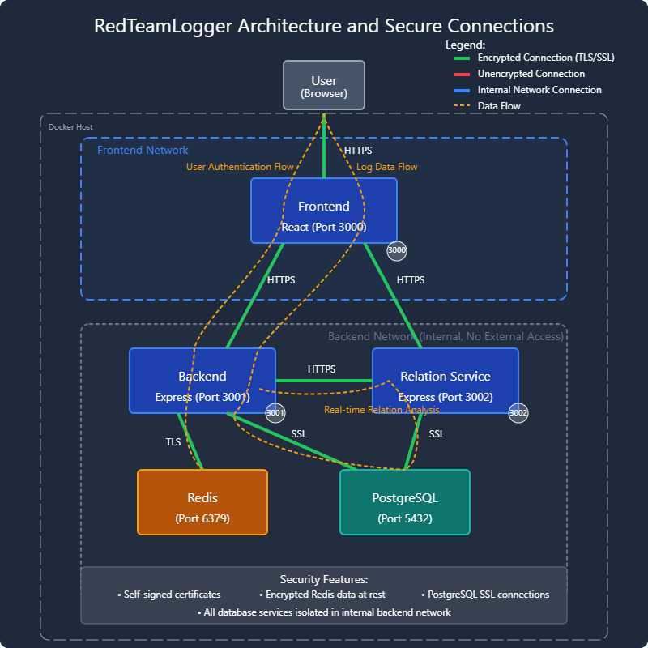

# Architecture Overview

Clio uses a microservices architecture with three primary components designed for security, scalability, and clear separation of concerns.

## System Architecture

The application consists of the following services:

1. **Frontend**: React-based UI with real-time data visualization
2. **Backend**: Core API service for authentication and logging operations
3. **Relation Service**: Analysis service that builds relationships between log entries
4. **Redis**: Session management and caching
5. **PostgreSQL**: Relational database for persistent storage

The frontend serves as a secure gateway to both backend services via a proxy configuration. This ensures that only the frontend port (3000) is exposed to users, while the backend and relation-service remain protected internally.

## Network Security

- Only the frontend port (3000) is exposed to external connections
- Backend and relation-service ports are only accessible within the Docker network
- All external requests are proxied through the frontend for enhanced security
- TLS certificates are used for all inter-service communication

After deployment, the following services will be running:

- **Frontend**: https://localhost:3000 (exposed to users)
- **Backend**: https://backend:3001 (internal only)
- **Relation Service**: https://relation-service:3002 (internal only)
- **Redis**: rediss://redis:6379 (internal only)
- **PostgreSQL**: postgres://db:5432 (internal only)

## Technology Stack

### Frontend
- **React 19.0.0**: Latest version of React for UI components
- **Tailwind CSS 3.3.0**: Utility-first CSS framework
- **Lucide React 0.475.0**: Icon library
- **Modern JavaScript (ES6+)**: For frontend logic

### Backend
- **Node.js 23**: Server runtime environment
- **Express.js 4.18.2**: Web framework
- **PostgreSQL 17**: Relational database
- **Redis 7.4.2**: Session management and caching
- **JWT 9.0.2**: For secure authentication
- **Docker & Docker Compose**: For containerization and orchestration

### Relation Service
- **Node.js 23**: Server runtime environment
- **Express.js 4.18.2**: Web framework
- **Shared PostgreSQL database**: For data consistency across services
- **Specialized analysis algorithms**: For relationship mapping

## Data Flow

1. **User Authentication**:
   - User credentials are submitted to the frontend
   - Frontend proxies the request to the backend
   - Backend validates credentials and issues a JWT token
   - Token is stored as an HTTP-only cookie

2. **Log Operations**:
   - Log entries are submitted through the frontend
   - Backend handles CRUD operations and persistence
   - Changes are logged to audit trails
   - Relation service analyzes logs to build relationship graphs

3. **API Integration**:
   - External tools authenticate using API keys
   - Log data is submitted directly to the API endpoints
   - Backend validates, sanitizes, and stores the data
   - Audit events track all API operations

## Containerization

All services are containerized using Docker, with configuration managed through Docker Compose. This approach ensures:

- Consistent environments across development and production
- Isolated service dependencies
- Simplified deployment and scaling
- Clear separation of concerns