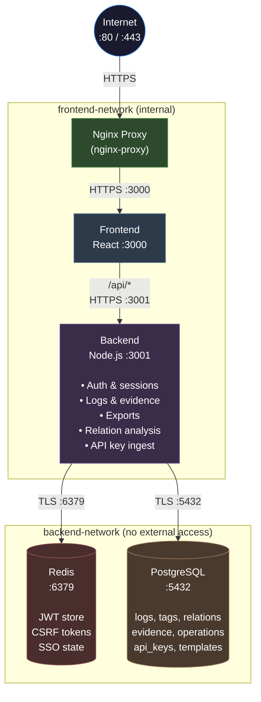
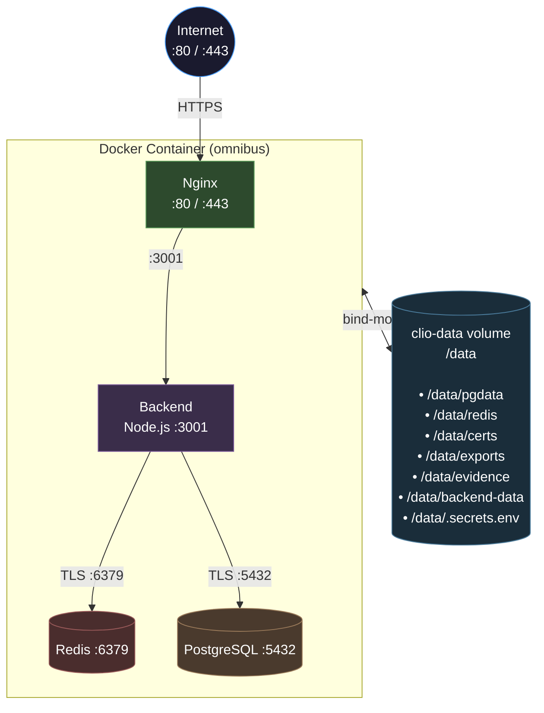
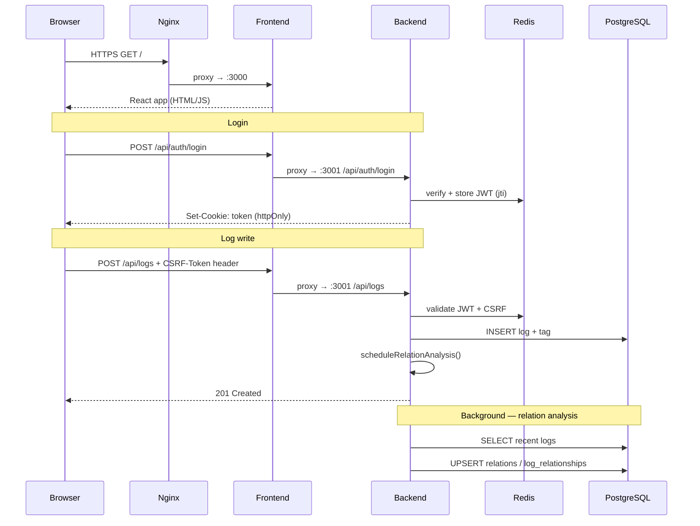
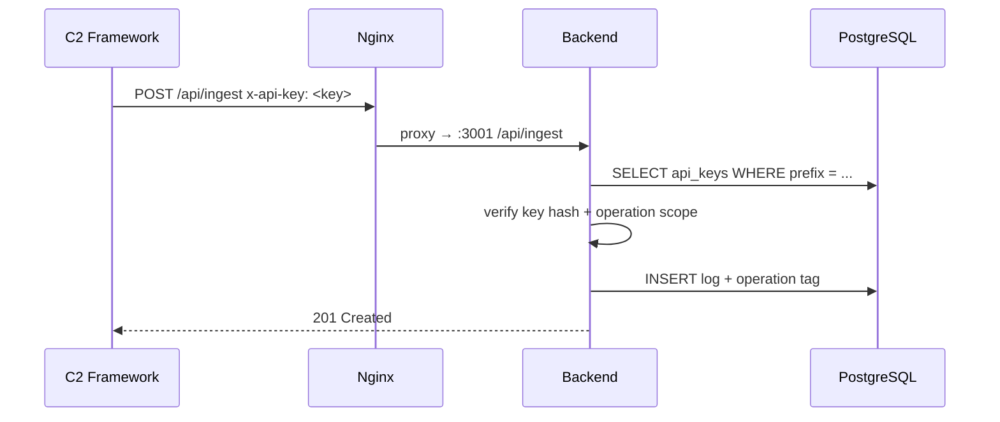

# Architecture Overview

Clio is designed for security, simplicity, and clear separation of concerns. Two deployment modes are supported: a single omnibus container and a multi-container HA stack.

## System Architecture

### HA multi-container stack

Five containers communicate over isolated Docker networks:

1. **Nginx Proxy** — HTTPS termination and traffic routing to the frontend
2. **Frontend** — React UI; proxies `/api/*` to the backend
3. **Backend** — Core API: authentication, logging, relational analysis, evidence, exports
4. **Redis** — Session management, JWT tracking, and caching
5. **PostgreSQL** — Persistent relational database

> **Note:** The relation analysis service (previously a separate `relation-service` container on port 3002) has been consolidated into the backend. All relational analysis endpoints are served by the backend at `/api/relations/*`. The frontend proxy path `/relation-service/api/*` is rewritten to `/api/*` at the Nginx/proxy layer for backward compatibility.

```mermaid
graph TD
    Internet((Internet\n:80 / :443))

    Internet -->|HTTPS| Nginx["Nginx Proxy\n(nginx-proxy)"]

    subgraph frontend-net ["frontend-network (internal)"]
        Nginx -->|HTTPS :3000| Frontend["Frontend\nReact :3000"]
        Frontend -->|/api/*\nHTTPS :3001| Backend["Backend\nNode.js :3001\n\n• Auth & sessions\n• Logs & evidence\n• Exports\n• Relation analysis\n• API key ingest"]
    end

    subgraph backend-net ["backend-network (no external access)"]
        Backend -->|TLS :6379| Redis[("Redis\n:6379\n\nJWT store\nCSRF tokens\nSSO state")]
        Backend -->|TLS :5432| PG[("PostgreSQL\n:5432\n\nlogs, tags, relations\nevidence, operations\napi_keys, templates")]
    end

    style Internet fill:#1a1a2e,color:#fff,stroke:#4a9eff
    style Nginx fill:#2d4a2d,color:#fff,stroke:#5a9a5a
    style Frontend fill:#2d3a4a,color:#fff,stroke:#5a7a9a
    style Backend fill:#3a2d4a,color:#fff,stroke:#7a5a9a
    style Redis fill:#4a2d2d,color:#fff,stroke:#9a5a5a
    style PG fill:#4a3a2d,color:#fff,stroke:#9a7a5a
```

### Omnibus single-container

All five components (Nginx, backend, Redis, PostgreSQL, and supervisord as the process manager) run inside one image. All state is stored in a mounted Docker volume (`/data`).

```mermaid
graph TD
    Internet((Internet\n:80 / :443))
    Internet -->|HTTPS| NginxO["Nginx\n:80 / :443"]

    subgraph Container ["Docker Container (omnibus)"]
        NginxO -->|:3001| BackendO["Backend\nNode.js :3001"]
        BackendO -->|TLS :6379| RedisO[("Redis :6379")]
        BackendO -->|TLS :5432| PGO[("PostgreSQL :5432")]
    end

    Container <-->|bind-mount| Volume[("clio-data volume\n/data\n\n• /data/pgdata\n• /data/redis\n• /data/certs\n• /data/exports\n• /data/evidence\n• /data/backend-data\n• /data/.secrets.env")]

    style Internet fill:#1a1a2e,color:#fff,stroke:#4a9eff
    style NginxO fill:#2d4a2d,color:#fff,stroke:#5a9a5a
    style BackendO fill:#3a2d4a,color:#fff,stroke:#7a5a9a
    style RedisO fill:#4a2d2d,color:#fff,stroke:#9a5a5a
    style PGO fill:#4a3a2d,color:#fff,stroke:#9a7a5a
    style Volume fill:#1a2d3a,color:#fff,stroke:#4a7a9a
```

## Network Security

- Only the Nginx proxy ports (80, 443) are exposed to external connections
- Frontend and backend ports are only accessible within the Docker network
- All external requests are proxied through Nginx to the frontend
- The frontend then proxies API requests to the backend
- TLS certificates are used for all inter-service communication

After deployment, the following services will be running (HA stack):

- **Nginx Proxy**: http://localhost:80 and https://localhost:443 (exposed to users)
- **Frontend**: https://frontend:3000 (internal only)
- **Backend**: https://backend:3001 (internal only)
- **Redis**: rediss://redis:6379 (internal only)
- **PostgreSQL**: postgres://db:5432 (internal only)

## Technology Stack

### Nginx Proxy
- **Nginx Alpine**: Lightweight web server and reverse proxy
- **Let's Encrypt integration**: For production-grade SSL certificates
- **Automatic certificate selection**: Uses Let's Encrypt certificates when available, fallback to self-signed

### Frontend
- **React 19.0.0**: Latest version of React for UI components
- **Tailwind CSS 3.3.0**: Utility-first CSS framework
- **Lucide React 0.475.0**: Icon library
- **Modern JavaScript (ES6+)**: For frontend logic
- **HTTP-Proxy-Middleware**: For proxying API requests to backend services

### Backend
- **Node.js 23**: Server runtime environment
- **Express.js 4.18.2**: Web framework
- **PostgreSQL 17**: Relational database
- **Redis 7.4.2**: Session management and caching
- **JWT 9.0.2**: For secure authentication
- **Docker & Docker Compose**: For containerization and orchestration

### Relation Analysis (built into Backend)
- Analyzers run as in-process services within the backend (no separate container)
- Debounced scheduling via `analysisScheduler.js` — batches updates after log writes
- Scheduled cron jobs for periodic full-sweep analysis
- Five analysis tables in the shared PostgreSQL database: `relations`, `log_relationships`, `file_status`, `file_status_history`, `tag_relationships`

## Data Flow

### Browser request flow

```mermaid
sequenceDiagram
    participant B as Browser
    participant N as Nginx
    participant F as Frontend
    participant K as Backend
    participant R as Redis
    participant D as PostgreSQL

    B->>N: HTTPS GET /
    N->>F: proxy → :3000
    F-->>B: React app (HTML/JS)

    Note over B,K: Login
    B->>F: POST /api/auth/login
    F->>K: proxy → :3001 /api/auth/login
    K->>R: verify + store JWT (jti)
    K-->>B: Set-Cookie: token (httpOnly)

    Note over B,K: Log write
    B->>F: POST /api/logs  + CSRF-Token header
    F->>K: proxy → :3001 /api/logs
    K->>R: validate JWT + CSRF
    K->>D: INSERT log + tag
    K->>K: scheduleRelationAnalysis()
    K-->>B: 201 Created

    Note over K,D: Background — relation analysis
    K->>D: SELECT recent logs
    K->>D: UPSERT relations / log_relationships
```

### C2 / API ingest flow

```mermaid
sequenceDiagram
    participant C2 as C2 Framework
    participant N as Nginx
    participant K as Backend
    participant D as PostgreSQL

    C2->>N: POST /api/ingest  x-api-key: <key>
    N->>K: proxy → :3001 /api/ingest
    K->>D: SELECT api_keys WHERE prefix = ...
    K->>K: verify key hash + operation scope
    K->>D: INSERT log + operation tag
    K-->>C2: 201 Created
```

## Containerization

All services are containerized using Docker, with configuration managed through Docker Compose. This approach ensures:

- Consistent environments across development and production
- Isolated service dependencies
- Simplified deployment and scaling
- Clear separation of concerns

## SSL/TLS Handling

Clio supports two certificate types:

1. **Self-signed certificates**: Used for development environments
   - Generated automatically during setup
   - Used for all inter-service communications
   - Used for frontend if Let's Encrypt is not configured

2. **Let's Encrypt certificates**: Used for production environments
   - Can be configured during setup with the `--letsencrypt` flag
   - Automatically renewed via cron jobs
   - Used by Nginx for external connections
   - Self-signed certificates still used for internal service communication