# User Guide

This guide explains how to use the Clio Logging Platform for red team operations. Clio provides a collaborative environment for tracking activities, managing file status, and analyzing relationships between different entities.

## Getting Started

### Authentication

1. Access the application at https://localhost:3000 (or your configured domain)
2. Log in with your provided credentials:
   - For the first login, use the credentials generated during setup
   - You will be prompted to change your password on first login

### User Roles

- **Admin**: Full access to all features, including user management, exports, and system settings
- **User**: Access to log entries, relationships, and file status tracking

## Main Interface

The Clio interface consists of several primary views accessible from the top navigation:

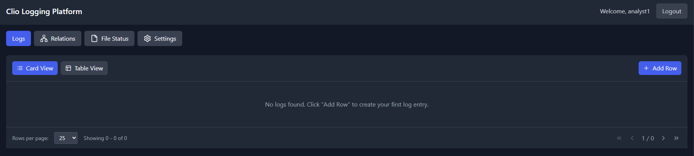

### Logs View

The Logs view is the main logging interface for recording and tracking activities.

**Key Features:**
- **Add Row**: Create a new log entry
- **Edit Cells**: Click on any cell to edit its content
- **Row Locking**: Lock a row to prevent others from editing it while you work
- **Cell Navigation**: Use Tab key to navigate between cells
- **Evidence Management**: Attach files and evidence to log entries

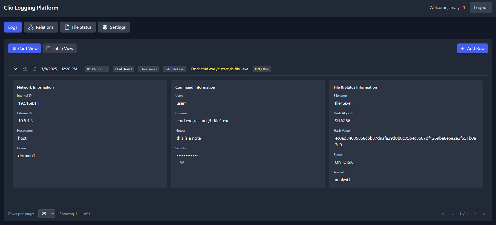

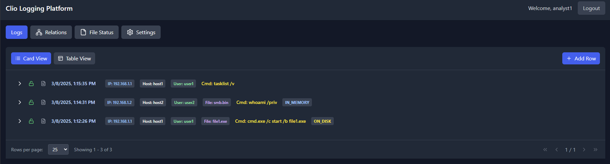

 
There is a legacy view which might not be supported for long term support 
If there is interest in keeping it, let me know
 

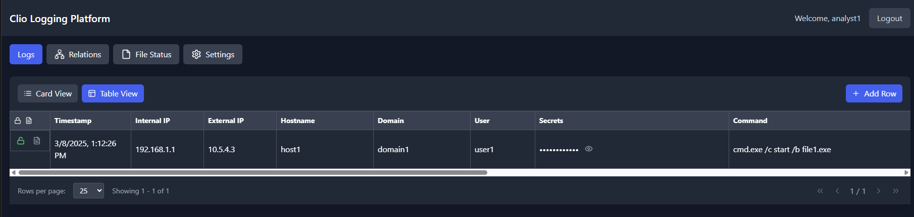

**Working with Log Entries:**
1. Click "Add Row" to create a new log entry
2. Fill in relevant details such as IPs, hostnames, commands, and status
3. Use the lock icon to lock/unlock rows as needed
4. Add evidence files by clicking the file icon in each row

**Log Entry Fields:**
- **Internal IP**: Target system internal IP address
- **External IP**: External/public IP address
- **Hostname**: System hostname
- **Domain**: Associated domain
- **Username**: User account being used
- **Command**: Command executed on the system
- **Notes**: Additional context or observations
- **Filename**: Name of relevant files
- **Hash Algorithm**: Algorithm of following file hash
- **Hash Value**: Hash value of file or other
- **Status**: Current status (ON_DISK, IN_MEMORY, etc.)
- **Secrets**: Credentials or tokens (automatically masked)

**Evidence Handling:**
- Upload screenshots, logs, code, and other evidence files
- Supported formats: JPG, PNG, GIF, PDF, TXT, PCAP
- Maximum file size: 10MB per file, 5 files per upload
- Add descriptions to evidence for better context

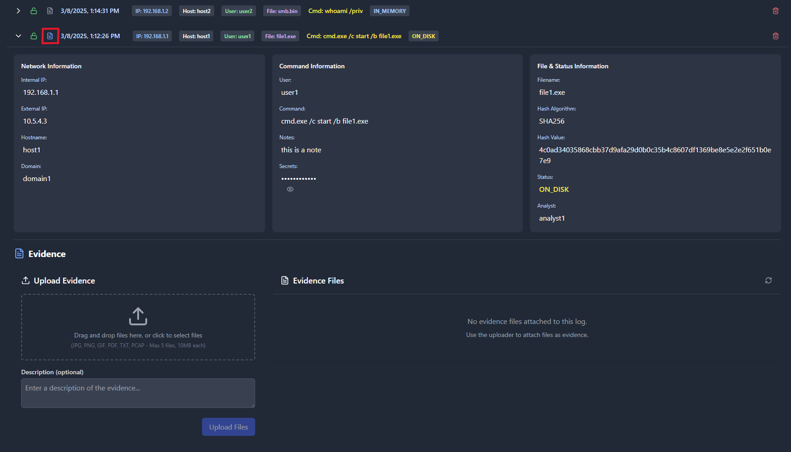

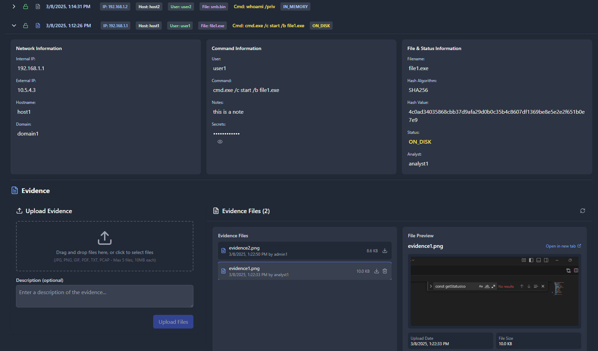

### Relations View

The Relations view visualizes connections between different system elements.

**Key Features:**
- **Network Visualization**: See connections between entities
- **Filtering**: Filter by relationship type (IP, hostname, domain, user)
- **Expandable Nodes**: Click to see detailed connection information
- **User Command Analysis**: Track command patterns by user

**Using Relationships:**
1. Select the relationship type from the top filter buttons
2. Expand nodes to view connected entities
3. Use the refresh button to update relationship data

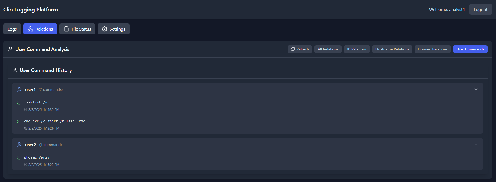

### File Status View

The File Status view tracks files across systems with different statuses.

**Status Types:**
- **ON_DISK**: File is still present on the target system
- **IN_MEMORY**: File is loaded only in memory
- **ENCRYPTED**: File is present but encrypted
- **REMOVED**: File has been deleted
- **CLEANED**: File and traces have been removed
- **DORMANT**: Inactive but still present
- **DETECTED**: AV/EDR has flagged the file
- **UNKNOWN**: Status requires verification

**File Tracking Features:**
- Filter by status, hostname, or analyst
- View file history and changes over time
- Track hashes and file metadata
- Search for specific files

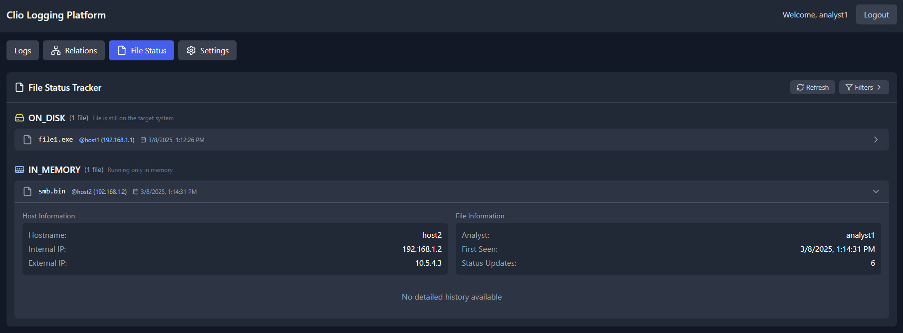

## Admin Features

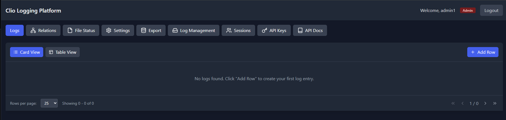

### Export Database

Admins can export data for offline analysis or reporting:

1. Select columns to include in the export
2. Choose between CSV-only or full evidence package
3. Optional: Include relationship data and hash information
4. Export files are saved on the server for secure handling

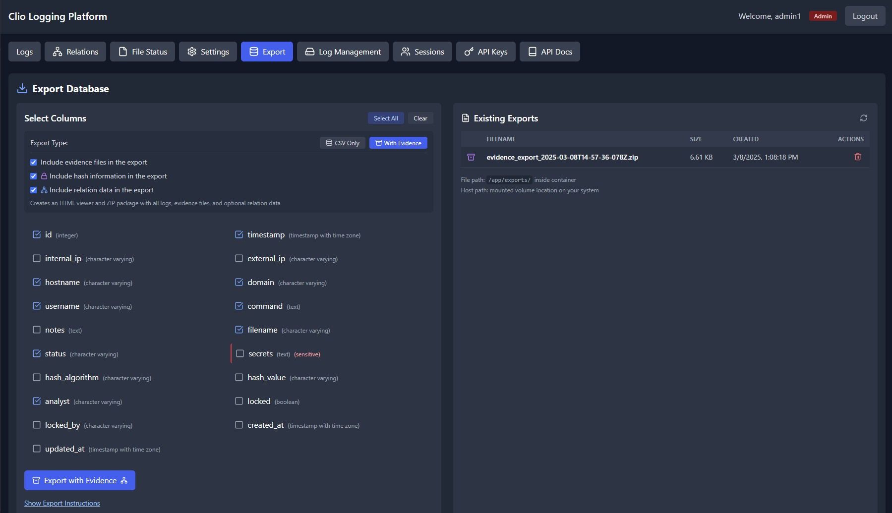

### Session Management

Admins can monitor and manage active user sessions:

1. View all current user sessions
2. Revoke individual sessions as needed
3. Force global logout for all users in case of security concerns
4. Track session duration and last activity

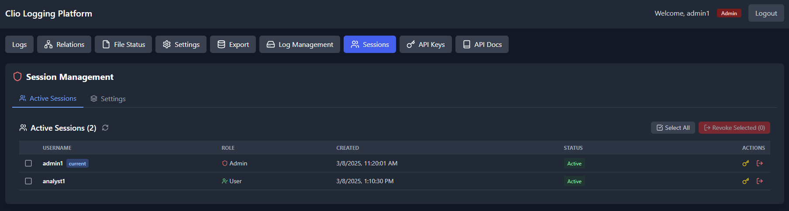

### API Key Management

Admins can create and manage API keys for integration with external tools:

1. Create API keys with specific permissions
2. Set optional expiration dates
3. View usage statistics and last used time
4. Revoke or delete keys as needed

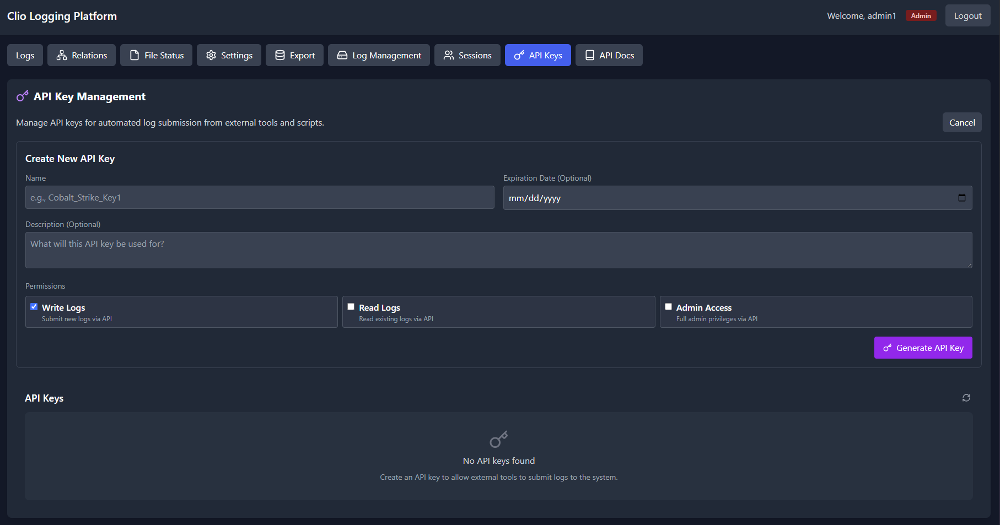

### Log Management

Admins can manage the system logs:

1. Auto rotation of logs every 24 hours
2. Force logs to rotate and zip
3. Track the log exports
4. If file size exceeds limit, will auto zip and rotate

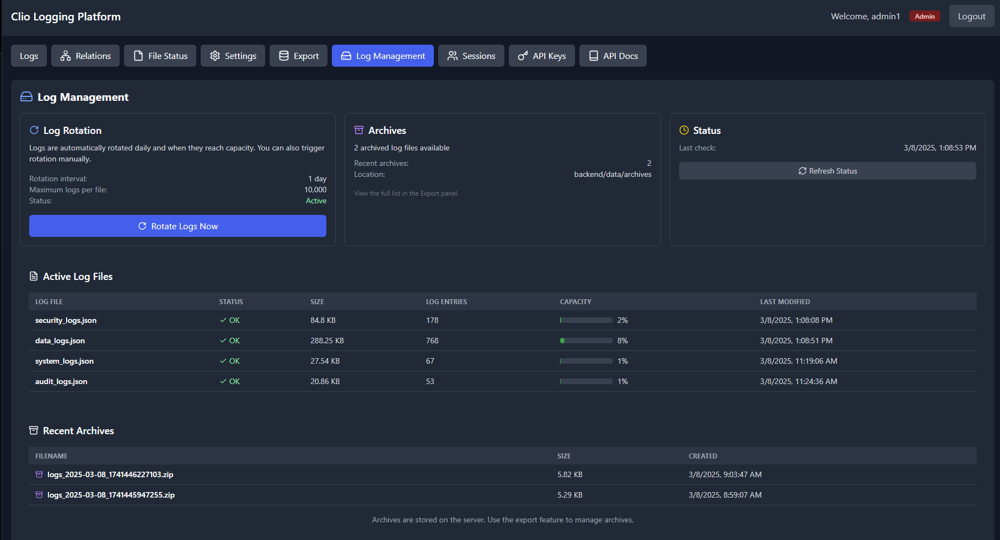

## Tips and Best Practices

1. **Lock rows** when actively working on them to prevent conflicts
2. **Add detailed notes** to provide context for other team members
3. **Attach evidence files** to document findings and observations
4. **Update file status** consistently as operations progress
5. **Use consistent hostnames and IPs** to ensure proper relationship mapping
6. **Check relationships view** to understand network connections